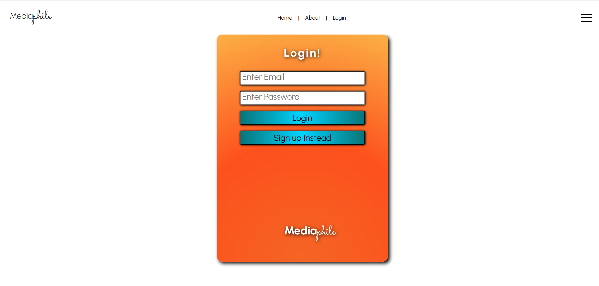
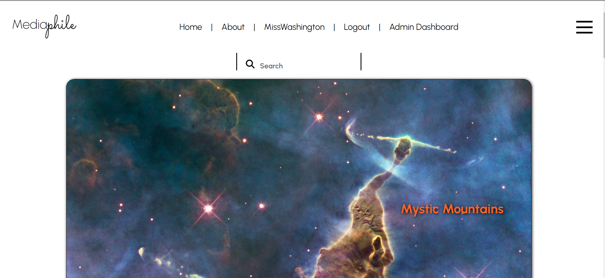
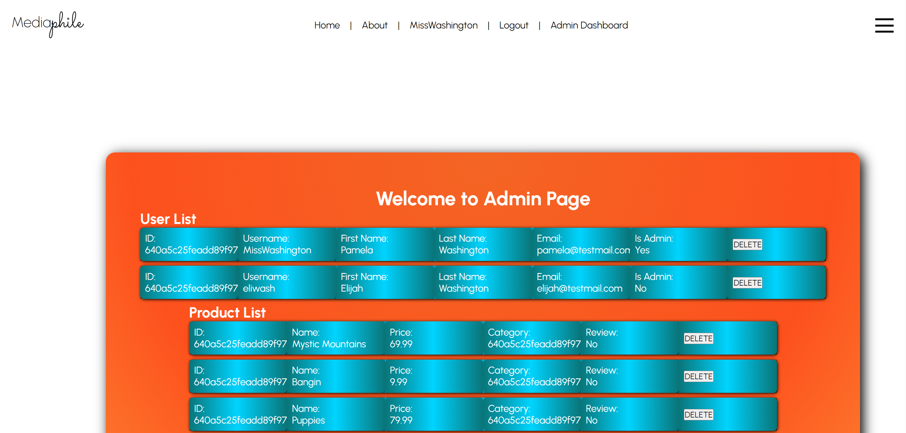
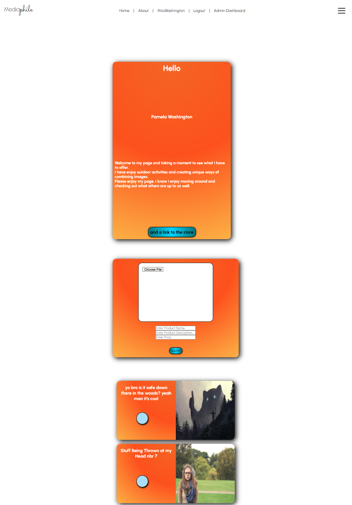
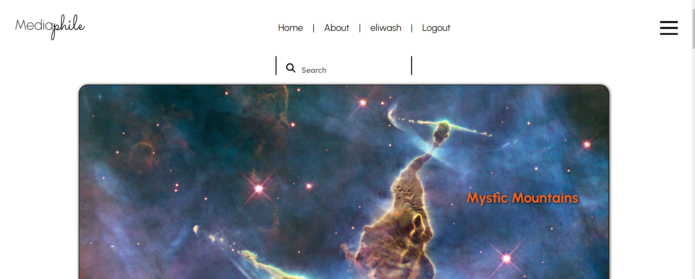
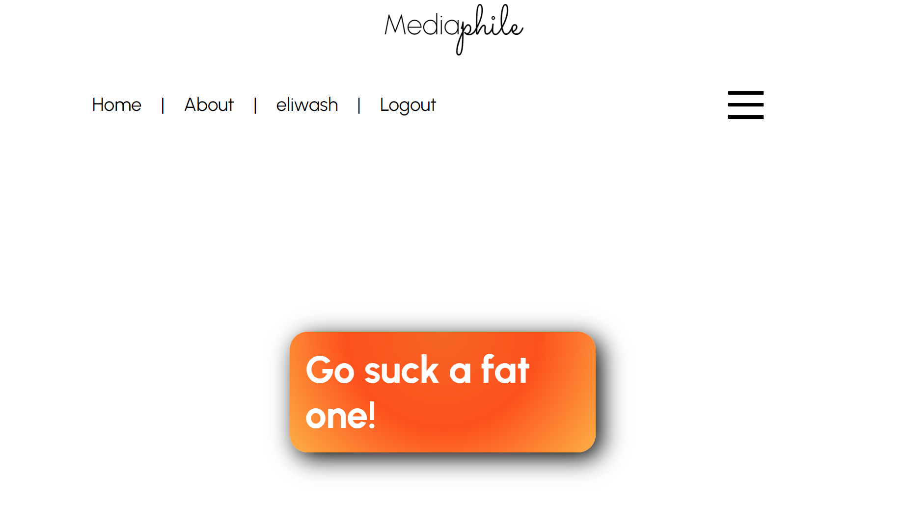
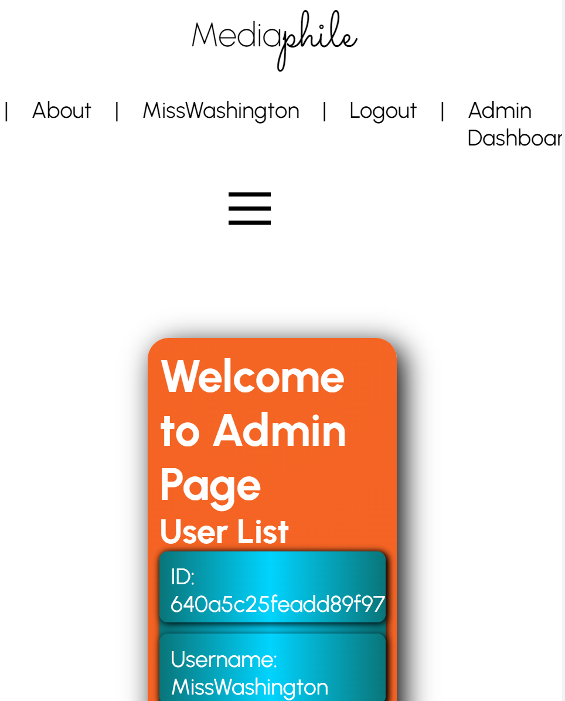
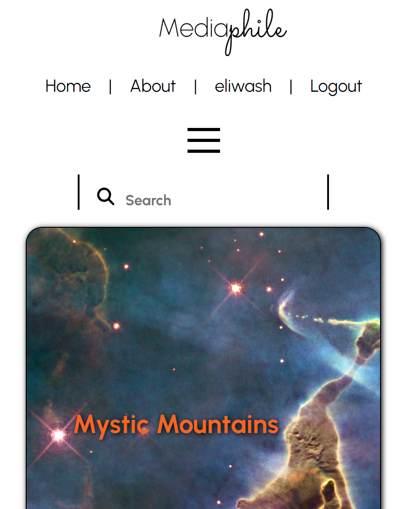

# pending_too
Pending 2 Still Waiting

## Team Members:
* James VonLienen https://github.com/unbindingNote 
* Josh Cooley https://github.com/JCool221 
* Laura Beutler https://github.com/labeutler  
* Melissa Goncalves https://github.com/Melissagon 
* Sam Bensema https://github.com/sammythyst 
* Shawn Karalash https://github.com/Ralakash 

## Table of Contents

- [Description](#description)
- [Installation](#installation)
- [Usage](#usage)
- [Credits](#credits)
- [License](#license)

## Description

An ecommerce store for artists and art lovers. Our last project was a blog for artists, we wanted to create a space for them to sell their art while still allowing others to like, dislike and have a conversation about the art. 

## Installation

No installation needed, simply navigate to https://mediaphile-shop.herokuapp.com/

## Usage

### Register for an account or login:

### Scroll or use search bar to find art, like it, dislike it, leave a review, or add it to your cart. 

### As an administer of the account, when you log in, you will have additional access to another page that will allow you to delete users or items if necessary. 

### Admin Page will provide you with access to a User List and a Product List.

### When you are logged in, you can look at your personal page that offers you a chance to see items you have added, ability to add another item, and offer a chance to add information about yourself.

### If logged in as a regular user without admin privilages, you will still have access to see your personal account. 

### If a user tries to access the Admin page without authorization, they will see the following screen: 

### Our site is also responsive to be viewed on mobile devices.  

## Credits

Pictures from Google. 

## License

The MIT License (MIT)

Copyright (c) 2023 MediaPhile

Permission is hereby granted, free of charge, to any person obtaining a copy of this software and associated documentation files (the "Software"), to deal in the Software without restriction, including without limitation the rights to use, copy, modify, merge, publish, distribute, sublicense, and/or sell copies of the Software, and to permit persons to whom the Software is furnished to do so, subject to the following conditions:

The above copyright notice and this permission notice shall be included in all copies or substantial portions of the Software.

THE SOFTWARE IS PROVIDED "AS IS", WITHOUT WARRANTY OF ANY KIND, EXPRESS OR IMPLIED, INCLUDING BUT NOT LIMITED TO THE WARRANTIES OF MERCHANTABILITY, FITNESS FOR A PARTICULAR PURPOSE AND NONINFRINGEMENT. IN NO EVENT SHALL THE AUTHORS OR COPYRIGHT HOLDERS BE LIABLE FOR ANY CLAIM, DAMAGES OR OTHER LIABILITY, WHETHER IN AN ACTION OF CONTRACT, TORT OR OTHERWISE, ARISING FROM, OUT OF OR IN CONNECTION WITH THE SOFTWARE OR THE USE OR OTHER DEALINGS IN THE SOFTWARE.

---
GitHub Repository
https://github.com/team-Pending/pending_too